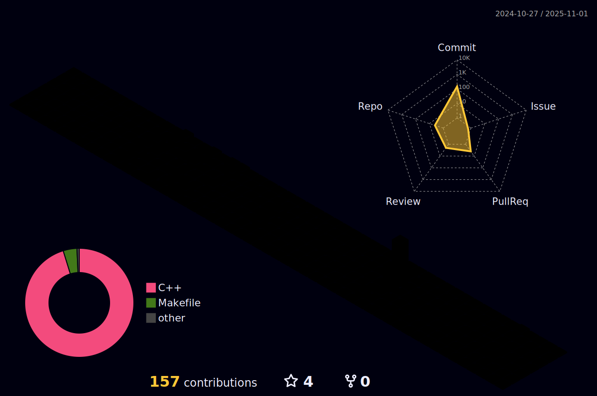

<h3 align="center">
  <a href="https://git.io/typing-svg">
    <!--      -->
    
  </a>
  </h1>

# Hi,there is Areay7👋
- I come from China.🇨🇳
- Bachelor degree in Internet of Things engineering
- This is my [blog](https://areay7.github.io), most of which is my study record, later thought, blog can also record some personal life what
- My [email](2507549477@qq.com), please contact me if you have any questions
- I am mainly engaged in C++, Java, embedded programming, artificial intelligence, and other aspects.
- Currently studying **I am currently studying courses in network communication and embedded systems.**
- These warehouses and blogs are also my witnesses on the way to college
- **Continue to create, continue to output, be a lifelong learner**


  

<a href="https://areay7.github.io" target="_blank" rel="noopener noreferrer"></a>


<a href="https://areay7.github.io/">
  
</a>


<a href="https://areay7.github.io/">
  
</a>





<h3 align="center">Languages and Tools:</h3>
<p align="center"> <a href="https://www.arduino.cc/" target="_blank" rel="noreferrer">  </a> <a href="https://www.gnu.org/software/bash/" target="_blank" rel="noreferrer">  </a> <a href="https://www.cprogramming.com/" target="_blank" rel="noreferrer">  </a> <a href="https://www.w3schools.com/cpp/" target="_blank" rel="noreferrer">  </a> <a href="hexo.io/" target="_blank" rel="noreferrer">  </a> <a href="https://www.linux.org/" target="_blank" rel="noreferrer">  </a> <a href="https://www.mathworks.com/" target="_blank" rel="noreferrer">  </a> <a href="https://www.python.org" target="_blank" rel="noreferrer">  </a> <a href="https://pytorch.org/" target="_blank" rel="noreferrer">  </a> </p>


<!--START_SECTION:waka-->


📅 **I'm Most Productive on Tuesday** 

```text
Monday                   162 commits         ████░░░░░░░░░░░░░░░░░░░░░   17.96 % 
Tuesday                  210 commits         ██████░░░░░░░░░░░░░░░░░░░   23.28 % 
Wednesday                169 commits         █████░░░░░░░░░░░░░░░░░░░░   18.74 % 
Thursday                 145 commits         ████░░░░░░░░░░░░░░░░░░░░░   16.08 % 
Friday                   101 commits         ███░░░░░░░░░░░░░░░░░░░░░░   11.20 % 
Saturday                 49 commits          █░░░░░░░░░░░░░░░░░░░░░░░░   05.43 % 
Sunday                   66 commits          ██░░░░░░░░░░░░░░░░░░░░░░░   07.32 % 
```


📊 **This Week I Spent My Time On** 

```text
🕑︎ Time Zone: Asia/Shanghai

💬 Programming Languages: 
No Activity Tracked This Week

🔥 Editors: 
No Activity Tracked This Week

💻 Operating System: 
No Activity Tracked This Week
```


 Last Updated on 03/08/2025 16:48:30 UTC
<!--END_SECTION:waka-->
